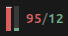
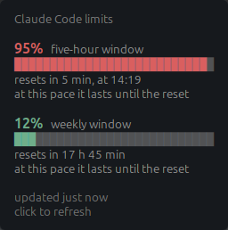

# Claude Code Limits — a Cinnamon panel applet

Shows how much of the five-hour and weekly Claude Code allowance is spent,
right in the Linux Mint panel. It reads the credentials Claude Code already
holds, so there is nothing to sign in to.

## What it shows



Two bars: the five-hour window on the left, the weekly one on the right. The
fill grows from the bottom and changes colour on the thresholds — green below
80%, amber from 80%, red from 90%. The left bar carries a thin **pace mark**:
the share of the five-hour window that has already passed. Fill above the mark
means spending is outrunning the window's recovery. The numbers beside the bars
can be hidden, shown on their own, or shown alongside.

<br clear="left">

Hovering gives a card with the percentages, the bars, a countdown to the reset
and a verdict — *at this pace you hit the limit by 13:46*. It is recomputed as
the pointer arrives, so the countdown and *updated N minutes ago* are always
current rather than frozen at the moment of the last request.



The panel language is a setting: English by default, Russian available. It is
an explicit choice rather than the session locale, so an English panel can sit
next to Russian applications. Error messages are always English.

## Install

```sh
git clone https://github.com/paradoxm/claude-limits-applet.git
ln -s "$PWD/claude-limits-applet/claude-limits@paradoxm" ~/.local/share/cinnamon/applets/
```

Then right-click the panel → *Applets* → *Claude Code Limits* → add.

The applet comes up with the session: as long as it sits in the panel it
appears at every login. There is no autostart checkbox because there is no
separate program — it is part of the panel and has no process of its own.

Needs Cinnamon 6.x and an installed, signed-in Claude Code.

## Settings

Right-click the applet → *Configure*.

| Setting | Default | What it does |
|---|---|---|
| Panel language | English | Language of the indicator and its card |
| What to show in the panel | Bars and numbers | Bars, numbers, or both |
| Pace mark | on | The elapsed share of the five-hour window |
| Amber from | 80% | Below this the indicator is green |
| Red from | 90% | Raised to the amber threshold if set below it |
| Poll the usage endpoint | on | Turns all network access off; the applet stays |
| Polling interval | 10 minutes | 1 to 60 |
| Refresh on click | on | A left click fetches fresh data |
| Skip polling while idle | on | Skips the poll while Claude Code is not working |
| Credentials file | `~/.claude/.credentials.json` | For a non-standard install |

## Where the data comes from

`GET https://api.anthropic.com/api/oauth/usage`, with the token from
`~/.claude/.credentials.json`. It is the same endpoint behind the figures at
`claude.ai/settings/usage`.

The credentials file is **only ever read**. The applet deliberately does not
refresh the token itself: the refresh token rotates, so renewing it here would
break the sign-in inside Claude Code. An expired token is reported as an error
— Claude Code will refresh it the next time you use it.

## How it stays within the rate limit

The endpoint is undocumented and returns no `anthropic-ratelimit-*` headers, so
the polling is deliberately cautious:

- **The header `User-Agent: claude-cli/<version> (external, cli)`.** Without it
  the request lands in a harshly limited bucket and gets a permanent 429 —
  [anthropics/claude-code#31021](https://github.com/anthropics/claude-code/issues/31021).
- **At most one request every 30 seconds**, whatever the interval setting says
  and however often the applet is clicked.
- **Exponential back-off** after a 429 or a 5xx: ten minutes doubling to an
  hour, reset by a successful answer. A 401 or 403 gets no back-off — time does
  not cure them, and the card says what to do instead of showing a code.
- **The whole polling state survives a Cinnamon restart** — both the time of
  the last request and the position on the back-off ladder. Otherwise
  restarting the panel during an hour-long back-off would reset it to zero.
- **The pause is visible.** While a back-off holds, the card says until when,
  and the indicator is dimmed.
- **Skipping while idle**: if `~/.claude/history.jsonl` has not changed for
  half an hour there is nothing being spent, so the poll is skipped.

At the default interval that is at most 144 requests a day.

## How it is built

The logic lives in `lib/`. It imports no `St`, no `Soup`, no `GLib`, and never
reads the clock — the current time always arrives as an argument. `applet.js`
is the only layer with side effects: widgets, network, files, cairo, timers.

| Module | Changes when |
|---|---|
| `lib/usage.js` | Anthropic changes the response shape |
| `lib/view.js` | the design changes |
| `lib/strings.js` | the wording changes, or a language is added |
| `lib/format.js` | durations and clocks are formatted differently |
| `lib/policy.js` | the thrift rules change |
| `lib/auth.js` | Claude Code changes its credentials format |

Failures travel as codes, not sentences: one module decides what went wrong,
another decides how to say it.

## Tests

```sh
npm test
```

76 tests, run against a real captured API response rather than an invented
shape. Coverage of `lib/`: 100% of lines and functions.

One branch in `lib/view.js` stays uncovered — the one that loads the sibling
modules under Cinnamon. It cannot execute under node, and faking it would be a
test written for the number rather than for the behaviour; it is exercised by
the applet loading into the panel at all. `applet.js` is deliberately not
covered: it holds no decisions, only effects.

## Licence

MIT
